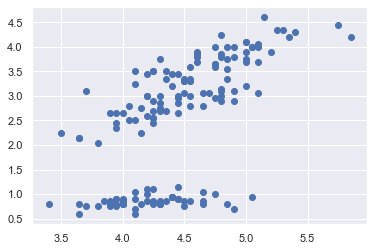

# Coding-Challenge

## Submission Procedure
Please follow the below instructions on how to submit your answers.

1. Create a new **public** repo and name it "ACM-Research-Coding-Challenge"
2. Clone this repo into your repo `git clone https://github.com/ACM-Research/Coding-Challenge ACM-Research-Coding-Challenge`
3. Complete the Challenge
4. Email the link of your repo to "research@acmutd.co" 

## Question One
Given the following dataset in ClusterPlot.csv:

Determine the number of clusters by using any clustering algorithm. Regardless if you can or cannot answer the question, provide a short explanation of how you got to your answer or how you think it can be solved in your README.md file.
